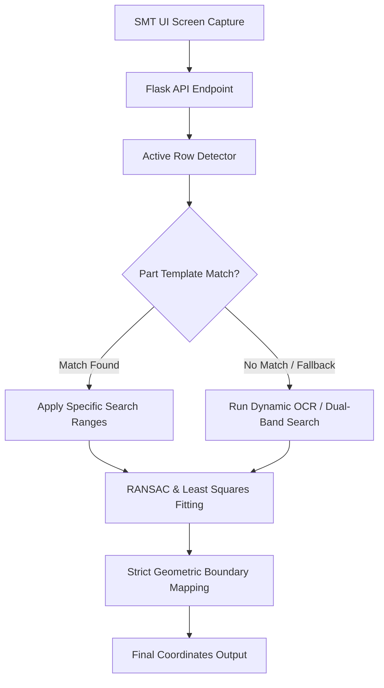

# Fuji Detect Vision System

High-precision computer vision backend designed for Surface Mount Technology (SMT) assembly line automation. It processes machine screen captures to detect active components, identify part shapes and sizes (circles and cylinders), and return sub-pixel boundary coordinates to assist RPA pipelines in robot alignment checks.

---

## 1. System Architecture



The service processes raw screenshots through a series of stages:
1. **API Routing**: Handles incoming base64 images via waitress on port 5000 in [app.py](file:///C:/Users/Lee%20Guang%20You/Documents/BioE%20Repo/fuji-detect/app.py).
2. **Active Row Detection**: Identifies which row is active in the parts table based on selection highlights.
3. **Template & OCR Matching**: Resolves the target shape and size configurations via template matching or fallback character OCR.
4. **Geometric Fitting**: Conducts RANSAC circle fitting or edge projection analysis to output sub-pixel coordinate bounds.

---

## 2. Core Processing Pipeline

| Step | Process Description | Robustness Rationale |
| :--- | :--- | :--- |
| **1. UI Slicing** | Extracts the active row text and camera region from the screen capture. | Identifies active row by calculating average row brightness (selection highlight). |
| **2. Part Recognition** | Matches the part name text against binary reference templates or decodes it via OCR. | Ignores colors and lighting changes by comparing shapes or decoding text. |
| **3. Thresholding** | Filters the image into a high-contrast binary edge map. | **Adaptive Thresholding**: Lowers the threshold dynamically when bright background noise is detected. |
| **4. Shape Fitting** | Fits candidate shapes using geometric fitting (RANSAC or edge projection profiles). | **Bezel Exclusion**: Automatically ignores any detected circle that matches the camera window border. |
| **5. Output Calculation** | Generates boundary coordinates (`top`, `bottom`, `left`, `right`). | **Pure Geometry**: Calculates coordinates purely from the shape geometry, avoiding false snaps to UI crosshairs. |

---

## 3. Pure Geometry Boundary Rules
To ensure the pipeline is robust against varying part sizes and does not falsely snap to UI crosshairs, boundary coordinates are calculated purely from the fitted shape geometry:

* **Top**: $[x_c, y_c - R]$
* **Bottom**: $[x_c, y_c + R]$
* **Left**: $[x_c - R, y_c]$
* **Right**: $[x_c + R, y_c]$

---

## 4. Part Size & Shape Configurations

### A. Circle Components
Circular targets prioritize specific nominal sizes based on the recognized part name:

| Part Name / Suffix | Circle Classification | Nominal Radius (px) | Search Range (px) |
| :--- | :--- | :---: | :---: |
| **`t0.2*11.0`** | Large | 240 | `[200, 320]` |
| **`t0.15*9.0`** | Medium | 75 | `[65, 90]` |
| **`t0.3*2.0`** | Small | 54 | `[45, 60]` |
| **`t0.15*10`** | Small | 28 | `[20, 35]` |

### B. Cylinder Components
For cylindrical targets, the system identifies the part name by checking for specific suffixes and applies horizontal/vertical projection peaks:

| Suffix | Shape Classification | Detection Method | Output Boundaries |
| :--- | :--- | :--- | :--- |
| **`FWD200X-170`** | Cylinder | Vertical & Horizontal Projection Peaks | `top`, `bottom`, `left`, `right` |
| **`KG3B_35_5F4Z`** | Cylinder | Vertical & Horizontal Projection Peaks | `top`, `bottom`, `left`, `right` |
| **`MBDT200X-170`** | Cylinder | Vertical & Horizontal Projection Peaks | `top`, `bottom`, `left`, `right` |

---

## 5. Dynamic Fallback System (Zero-Configuration Mode)
If an operator loads a part name that does not match any reference template:
1. **OCR-Assisted Range Resolution**: The system automatically runs character OCR on the parts name image. If the text is registered, the system pulls the correct circle profile parameters dynamically, bypassing template mismatches.
2. **Dual-Band Fallback**: If both template matching and OCR fail to identify the part, it falls back to a dual-band dynamic search:
   * **Small Pipeline**: Searches range `[20, 65]` pixels.
   * **Large Pipeline**: Searches range `[200, 320]` pixels.

---

## 6. Large Circle Alignment & Session Tracking
For large components (like `t0.2*11.0`), the circle is too large to fit in the camera's field of view at once. The operator aligns the component by capturing one edge at a time:
1. **Image 1**: Focuses on the **Bottom** edge.
2. **Image 2**: Focuses on the **Right** edge.
3. **Image 3**: Focuses on the **Top** edge.
4. **Image 4**: Focuses on the **Left** edge.

Because these 4 edges belong to the same component, the system tracks them under a shared `session_id`. Each API call only returns the active coordinate (e.g. `top`) while leaving other fields `null`. The downstream robot or RPA script groups the API responses by the `session_id` to accumulate all 4 boundaries.

---

## 7. API Reference

### POST `/api/v1/process_image`
Main inference endpoint. Matches `training_type` and routes base64 encoded image to the correct handler.

**Request Payload**
```json
{
  "training_type": "FUJI_DETECTOR",
  "img_base64": "iVBORw0KGgo...",
  "shape_type": "circle" 
}
```
* `training_type` (Required): Must be `"FUJI_DETECTOR"`.
* `img_base64` (Required): Base64-encoded screenshot.
* `shape_type` (Optional): `"circle"`, `"cylinder"`, or `null` for auto-detect.

**Response (Success - Circle)**
```json
{
  "success": true,
  "data": {
    "top": [139, 341],
    "bottom": null,
    "left": null,
    "right": null,
    "session_id": "session_2_t0.2*11.0"
  }
}
```

### POST `/api/v1/clear_sessions`
Clears all accumulated session data for large circle alignment.

**Response**
```json
{
  "success": true
}
```

---

## 8. Installation & Setup

### Prerequisites
Make sure Python 3.11+ is installed.

### Setup Instructions
1. Install Python package dependencies:
   ```bash
   pip install -r requirements.txt
   ```
2. Verify the configuration values inside [requirements.txt](file:///C:/Users/Lee%20Guang%20You/Documents/BioE%20Repo/fuji-detect/requirements.txt).

### Starting the API Server
Run the Flask-Waitress API server:
```bash
python app.py
```
This boots up the waitress server hosting the API at `http://localhost:5000`.

---

## 9. File Directory Overview
- [app.py](file:///C:/Users/Lee%20Guang%20You/Documents/BioE%20Repo/fuji-detect/app.py): Flask application entry point serving Waitress APIs.
- [pipeline.py](file:///C:/Users/Lee%20Guang%20You/Documents/BioE%20Repo/fuji-detect/pipeline.py): Infers shape routing per training type.
- [FUJI_DETECTOR/inspect.py](file:///C:/Users/Lee%20Guang%20You/Documents/BioE%20Repo/fuji-detect/FUJI_DETECTOR/inspect.py): Engine logic handling circle fitting, projection peak detection, and OCR.
- [requirements.txt](file:///C:/Users/Lee%20Guang%20You/Documents/BioE%20Repo/fuji-detect/requirements.txt): Version-pinned project dependencies.
- [.gitignore](file:///C:/Users/Lee%20Guang%20You/Documents/BioE%20Repo/fuji-detect/.gitignore): Workspace files excluded from version control (OS files, IDE directories, tests, local dataset images, agent settings, and docker settings).
